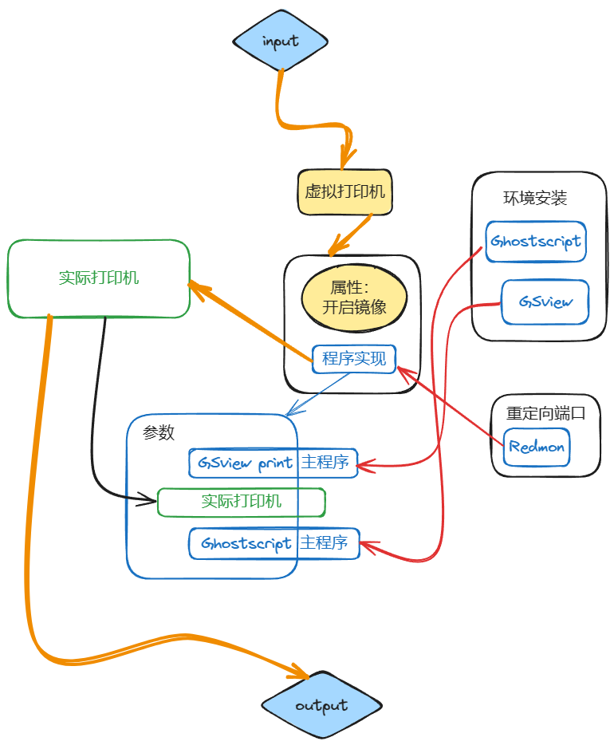
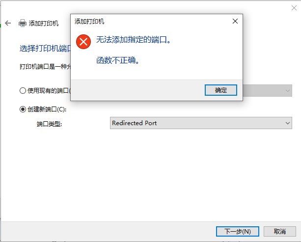

public:: true

- 更新时间:: [[Feb 29th, 2024]]
  tags:: redmon
- 灵感来源：[GhostScript实现镜像打印输出_操作系统_网上学园_科技时代_新浪网 (sina.com.cn)](https://tech.sina.com.cn/c/2001-09-10/5733.html)，[Ghostscript, Ghostview and GSview (wisc.edu)](https://pages.cs.wisc.edu/~ghost/)
- ## 准备：
	- [Ghostscript : Downloads](https://ghostscript.com/releases/gsdnld.html)
	- [Obtaining GSview 5.0 (ghostgum.com.au)](http://www.ghostgum.com.au/software/gsview.htm)
	- [RedMon - Redirection Port Monitor (ghostgum.com.au)](http://www.ghostgum.com.au/software/redmon.htm)
- ## 设计思路：
	- 
- ## redmon虚拟机打印设置
	- 
	- 安装后，添加本地打印机，创建新端口“Redirected Port”，端口名称（Port Name）默认，选择有镜像打印功能的打印机型号进行添加（例子使用了HP Color LaserJet 2800 Series PS）。
- ## 虚拟打印机默认设置修改
	- 
	- 虚拟打印机默认设置，开启镜像打印功能。
- ## 安装环境
	- 
	- 安装==Ghostscript==和==GSview==。
	- 安装==Ghostscript==后确保“Generate cidfmap for Windws CJK TrueType fonts”开启。
- ## 虚拟打印机配置输出参数1
	- 
	- 虚拟打印机端口配置中，重定向到==GSview==的`gsprint.exe`程序中。
- ## 虚拟打印机配置输出参数2
	- 
	- 配置`gsprint.exe`程序执行参数：
		- `-noquery` 打印时不输出日志
		- `-printer "name"` 指定实际打印机名称
		- `-ghostscript "name"` 指定==Ghostscript==主程序路径
		- 在所有参数最后**单独**添加一个`-`参数作为结尾。
		- （可选）“Run” 运行方式 “Hidden” 隐藏。
- ## 通过虚拟机打印
	- 
	- 打印时选择“虚拟打印机”进行打印。
- ## redmon不支持windows10及以上的系统
	- 
	- 解决方法见 [[clawPDF]]