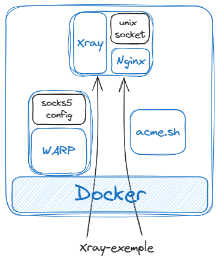

public:: true

- ## Debug
	- 验证 [[WARP]]服务提供的socks正常工作：  `curl -s4m8 -x socks5://127.0.0.1:40001 https://www.cloudflare.com/cdn-cgi/trace | grep warp`
		- 输出 `warp`的值off/on表示是否为warp网络。
	- 查看当前VPS的IP地址： `curl --request GET 'https://ip.useragentinfo.com/json' | jq .`
	- 访问部署域名的网站，如果能正常访问则代表该项目正常运行。
- ## 疑难
	- 如遇到VPS意外关闭，或VPS重启，请重新关闭系统防火墙。
	- 访问域名网站如遇到“网站证书过期”，代表 [[acme.sh]] 生成的证书需要续签，简单的处理方法是重启所有容器，如果是 [[Docker Compose]] ，重启后稍等片刻即可。
		- 可以通过`docker logs` [[acme.sh]] 的容器查看执行日志，可以检查证书续签的状态。
	- 如果遇到 nginx 容器不断重启，说明启动失败，可能原因是 *Unix域套接字地址* 的目录地址不是空的。简单的处理方式是停止所有容器，然后 `docker volume rm` `xrayunix`空间，然后再重新启动所有容器。如 [[Docker Compose]] 则清空所有容器重新创建启动即可。
	- 如果与VPS的链接速度慢，延迟高，检查 [[BBR]]是否开启，以及通过[[MTR]]检查VPS的网络线路，该问题没有不存在彻底的解决方案，由VPS提供商决定。
- ## 设计
	- 
- ## 参考
	- 如果你按照要求部署后你会得到一些东西，你至少要保证以下文件和目录存在：
		- ```
		  ./Xray-examples/                                   # Xray-examples 目录
		  ./Xray-examples/All-in-One-fallbacks-Nginx/xray    # xray 主程序
		  ./out/                                             # acme.sh 工作及产生证书目录
		  ./out/account.conf                                 # acme.sh 工作配置文件，由程序使用生成
		  ./xray/                                            # xray 配置文件目录
		  ./html/                                            # 静态模板放置目录
		  ./html/index.html                                  # 静态模板的主页html文件
		  ./nginx.server.conf/                               # nginx 配置文件目录
		  ```